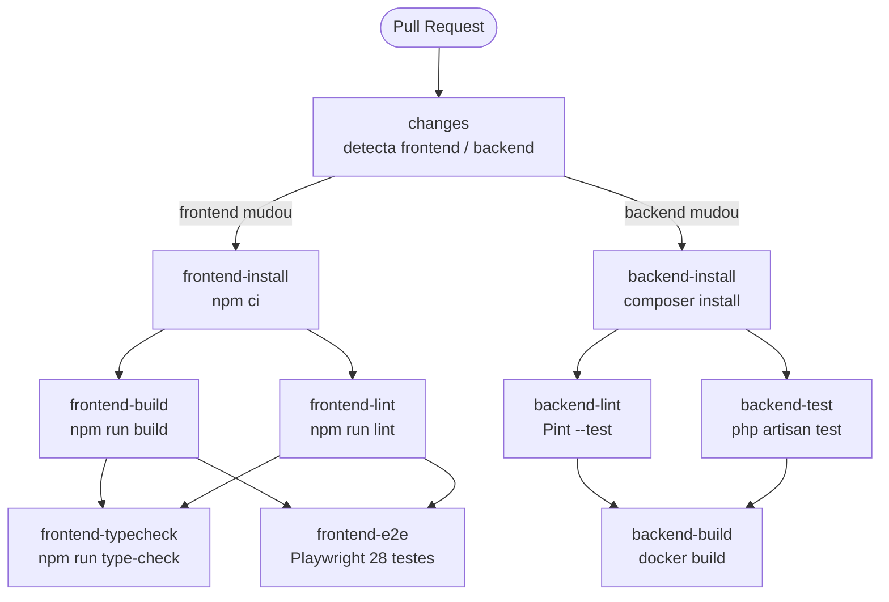

# Desafio Systock

Sistema de controle de estoque desenvolvido como desafio técnico, adaptado ao domínio da
Systock. Permite o cadastro e gerenciamento de usuários (com perfis `admin`/`operator`),
categorias e produtos, além do registro de movimentações de entrada e saída de estoque,
com o saldo de cada produto calculado a partir do histórico de movimentações. O projeto foi
construído com atenção especial à segurança da API, com mitigações para os principais vetores
do OWASP API Security Top 10 (ver seção "Análise de segurança" abaixo).

## Como subir o projeto

`docker-compose up --build` sobe o ambiente completo do zero (frontend, backend e banco de
dados PostgreSQL), incluindo a instalação de dependências, execução das migrations e seeders.

```bash
# Ambiente de desenvolvimento (Vite dev server com hot-reload)
docker-compose up --build

# Ambiente de produção/avaliação (frontend buildado, servido por Nginx)
docker-compose -f docker-compose.prod.yml up --build
```

URLs de acesso:

| Serviço | Desenvolvimento | Produção/avaliação |
|---|---|---|
| Frontend | http://localhost:3000 | http://localhost:8080 |
| API | http://localhost:8000/api | http://localhost:8000/api |
| Documentação OpenAPI (Swagger) | http://localhost:8000/api/documentation | indisponível (404 — restrito a ambientes não produtivos) |

## Autenticação

Usuários de seed disponíveis (senha `password` para ambos):

| E-mail | Perfil |
|---|---|
| admin@systock.com.br | admin |
| operador@systock.com.br | operator |

A API utiliza Laravel Sanctum no modelo de API Token (Bearer):

- `POST /api/login` — payload `{ "email": "...", "password": "..." }`. Em caso de sucesso,
  retorna `{ "token": "...", "user": { ... } }`. Credenciais inválidas retornam 422 com
  mensagem genérica, sem indicar se o e-mail existe (mitigação de enumeração de usuários —
  API2).
- Para as demais rotas, envie o token retornado no header
  `Authorization: Bearer <token>`.
- `POST /api/logout` (autenticado) — revoga o token atual e retorna 204.

## Arquitetura — Backend

Laravel 13 + PHP 8.4, servido via FrankenPHP.

- **Controllers** (`app/Http/Controllers/Api`): `AuthController`, `UserController`,
  `CategoryController`, `ProductController`, `StockMovementController`. Validações de entrada
  são feitas via Form Requests (`app/Http/Requests`), e os campos aceitos em cada operação são
  controlados pelos atributos `#[Fillable]` dos models, prevenindo mass assignment (API3).
- **Models** (`app/Models`): `User`, `Category`, `Product`, `StockMovement`, `IdempotencyKey`.
- **Autorização**: `UserPolicy` (`app/Policies`) restringe consulta/edição/exclusão de
  `/api/users/{id}` ao próprio usuário ou a um administrador (mitigação de IDOR — API1).
- **Autenticação**: Laravel Sanctum (tokens de API).
- **Idempotência**: middleware `idempotent` (`EnsureIdempotency`) cacheia a resposta de
  `POST /api/products/{product}/movements` por usuário/chave/rota, evitando duplicidade em
  reenvios (`X-Idempotent-Replay: true` na resposta cacheada).
- **Documentação OpenAPI**: L5-Swagger, disponível em `/api/documentation`. Em produção, o
  middleware `RestrictSwaggerToNonProduction` retorna 404 para essa rota (API9).
- **Modelo de dados**: `users` (com coluna `role`: `admin`/`operator`), `categories`,
  `products`, `stock_movements` (tipo `in`/`out`, vinculado a `product` e `user`) e
  `idempotency_keys` (suporte ao middleware de idempotência). O saldo de cada produto é
  calculado dinamicamente a partir da soma das movimentações de entrada e saída.

## Arquitetura — Frontend

Vue 3 + Vuetify 4 + TypeScript + Vite (Options API, Pinia para estado).

- **`views/`**: cada tela fica em seu próprio diretório, com `*.vue`, `store.ts` (Pinia,
  estado e ações específicas da tela) e `integrations/` (chamadas à API e tipos de
  request/response). Telas atuais: `LoginView`, `users/UsersView`, `users/UserFormView`,
  `products/ProductsView`, `products/ProductFormView`.
- **`stores/`**: stores Pinia globais — `auth` (usuário autenticado, token, login/logout) e
  `notifications` (snackbars/avisos).
- **`services/`**: instâncias Axios — `api.ts` (autenticada, injeta o Bearer token) e
  `publicApi.ts` (rotas públicas, como login).
- **`helpers/`**: funções utilitárias compartilhadas, como `cpf` (formatação), `pagination`,
  `select` e `permissions` (`canManageUser`, que esconde ações restritas na UI com base no
  `role`/`id` do usuário autenticado, refletindo a `UserPolicy` do backend).
- **Roteamento** (`router/index.ts`): rotas para login, usuários e produtos, com guarda de
  navegação que redireciona para `/login` quando não autenticado.

## Pipeline CI/CD

Acionado em pull requests para `main`. Detecta quais partes do monorepo mudaram e executa apenas os jobs relevantes.



## Testes

- **Postman/Newman**: a coleção em [`postman/`](./postman) cobre os fluxos principais da API
  e os vetores de segurança descritos na seção abaixo (ver `postman/README.md`).
- **PHPUnit (backend)** e **Vitest (frontend)**: testes automatizados estão planejados para a
  última fase do projeto, após a versão final do frontend, e ainda não foram escritos. A
  cobertura atual de fluxos e segurança é garantida pela coleção Postman/Newman.

## Coleção Postman

A pasta [`postman/`](./postman) contém a coleção e o ambiente para testar a API manualmente,
incluindo os payloads usados na análise de segurança abaixo. Ver
[`postman/README.md`](./postman/README.md) para instruções de importação e execução.

## Análise de segurança

Resultado da execução da coleção `postman/Desafio-Systock.postman_collection.json` via Newman
contra o backend implementado (v1.0).

| # | Vetor (OWASP API Top 10) | Status | Evidência |
|---|---|---|---|
| 1 | API1: Broken Object Level Authorization (IDOR) | 🛡️ Blindado | `Users / Buscar usuario de outro contexto - IDOR (API1)`: operador autenticado tentando consultar `GET /api/users/{id}` de outro usuário (admin) recebe 403 (`UserPolicy`: apenas o próprio usuário ou um admin pode ver/editar/excluir) |
| 2 | API2: Broken Authentication | 🛡️ Blindado | `Auth / Login - credenciais invalidas` → 401/422 sem enumeração de e-mail; `Auth / Acessar rota protegida sem token` → 401 |
| 3 | API3: Broken Object Property Level Authorization (Mass Assignment) | 🛡️ Blindado | `Users / Criar usuario - Mass Assignment (role=admin)`: campo `role` enviado no payload é ignorado (`$fillable`/`Form Requests` com `validated()`) |
| 4 | API4: Unrestricted Resource Consumption | 🛡️ Blindado | `Products / Criar produto - payload oversized`: input gigante rejeitado com 422 pela validação |
| 5 | API5: Broken Function Level Authorization | 🛡️ Blindado | `UserPolicy` restringe `/api/users/{id}` a admin/próprio usuário (ver item 1); middleware `admin` (EnsureAdmin) protege todas as rotas de escrita e listagem de usuários (`POST /users`, `PUT/DELETE /users/{id}`, `GET /users`, `POST/PUT/DELETE /products`, `GET /products/export`) — operadores que tentam acessar retornam 403 |
| 6 | API6: Unrestricted Access to Sensitive Business Flows (Race Condition) | 🛡️ Blindado | `Movements / Race Condition - saida concorrente do mesmo lote (API6)`: requisições concorrentes de saída resolvem com 201 ou 422, sem 500 nem `quantity_rem` negativo |
| 7 | API7: Server-Side Request Forgery (SSRF) | N/A | Sem campo de URL externa no v1.0 |
| 8 | API8: Security Misconfiguration | 🛡️ Blindado | `.env` fora do versionamento (`.gitignore`), `config/cors.php` restrito a `FRONTEND_URL`, `APP_DEBUG=false` em `.env.example` |
| 9 | API9: Improper Inventory Management | 🛡️ Blindado | Documentação OpenAPI (`/api/documentation`, L5-Swagger) protegida pelo middleware `RestrictSwaggerToNonProduction`, que retorna 404 quando `APP_ENV=production` |
| 10 | API10: Unsafe Consumption of APIs | N/A | Sistema não consome APIs de terceiros no v1.0 |
| 11 | Duplicidade por POST repetido (idempotência) | 🛡️ Blindado | `Movements / POST duplicado com mesma Idempotency-Key`: segunda chamada retorna a mesma resposta cacheada com header `X-Idempotent-Replay: true` |
| 12 | Exposição de credenciais no código-fonte | 🛡️ Blindado | Nenhum `.env` presente no histórico do Git (`.gitignore` desde o primeiro commit) |

**Legenda:** 🛡️ Blindado · ⚠️ Vulnerável · ⏳ A testar · N/A Não aplicável
