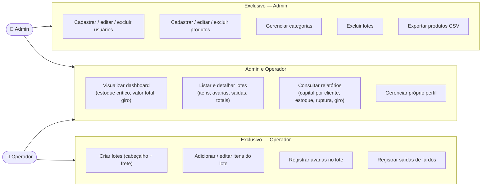
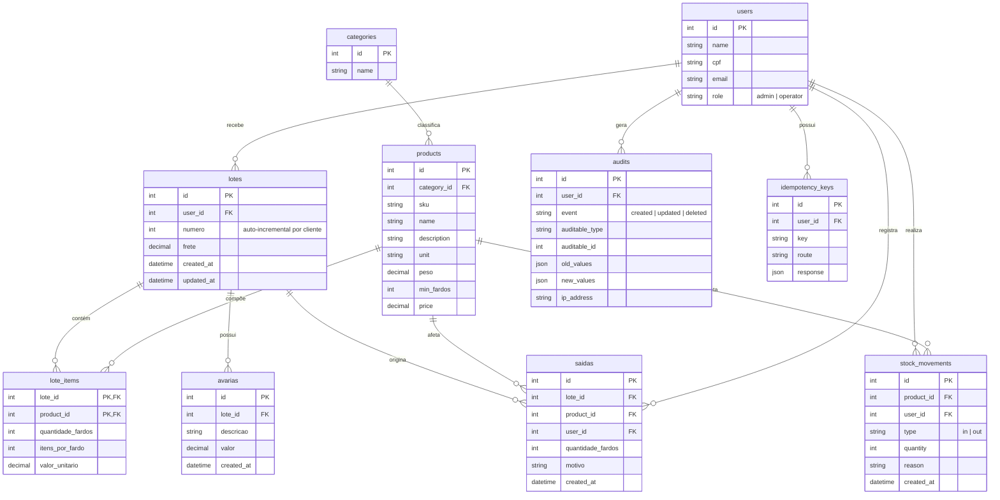
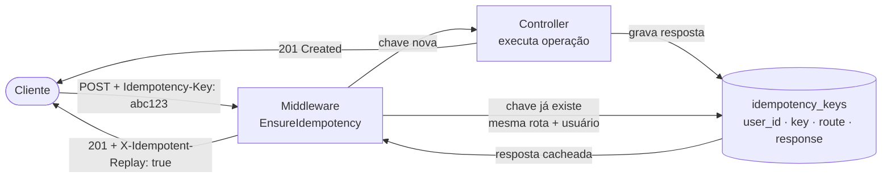
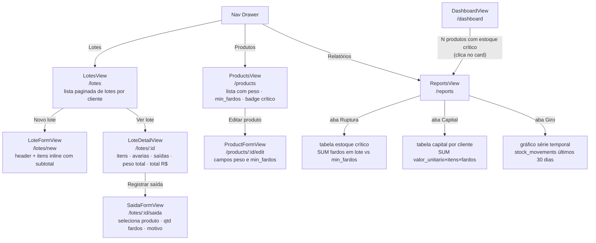
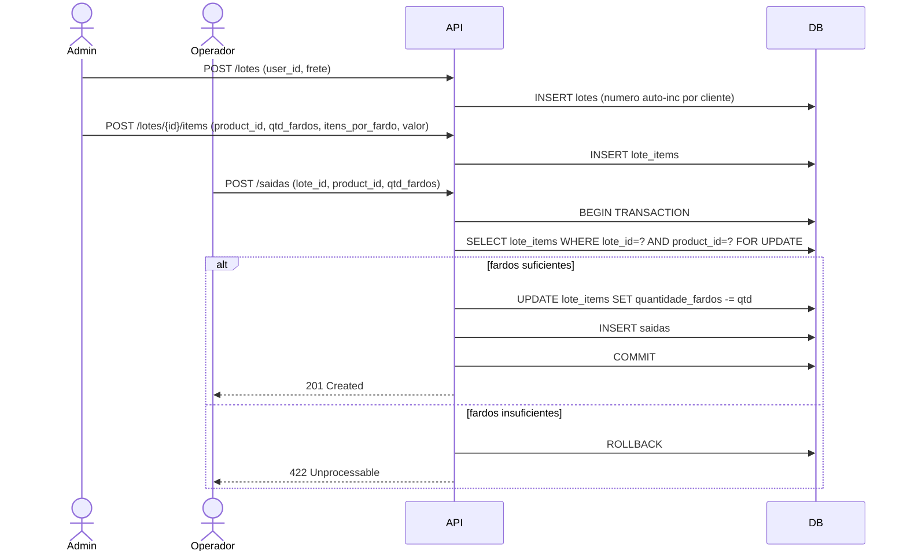
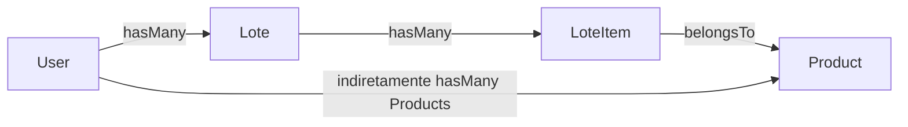

# Desafio Systock

Sistema de controle de estoque desenvolvido como desafio técnico, adaptado ao domínio da
Systock. Permite o cadastro e gerenciamento de usuários (com perfis `admin`/`operator`),
categorias e produtos, além do recebimento de mercadorias via **lotes** (nota fiscal/pedido),
com o estoque organizado em **fardos** por lote e saídas registradas explicitamente. O projeto
foi construído com atenção especial à segurança da API, com mitigações para os principais
vetores do OWASP API Security Top 10 (ver seção "Análise de segurança" abaixo).

## Como subir o projeto

`docker-compose up --build` sobe o ambiente completo do zero (frontend, backend e banco de
dados PostgreSQL), incluindo a instalação de dependências, execução das migrations e seeders.

```bash
# Ambiente de desenvolvimento (Vite dev server com hot-reload)
docker-compose up --build

# Ambiente de produção/avaliação (frontend buildado, servido por Nginx)
docker-compose -f docker-compose.prod.yml up --build
```

URLs de acesso:

| Serviço | Desenvolvimento | Produção/avaliação |
|---|---|---|
| Frontend | http://localhost:3000 | http://localhost:8080 |
| API | http://localhost:8000/api | http://localhost:8000/api |
| Documentação OpenAPI (Swagger) | http://localhost:8000/api/documentation | indisponível (404 — restrito a ambientes não produtivos) |

## Autenticação

Usuários de seed disponíveis (senha `password` para ambos):

| E-mail | Perfil |
|---|---|
| admin@systock.com.br | admin |
| operador@systock.com.br | operator |

A API utiliza Laravel Sanctum no modelo de API Token (Bearer):

- `POST /api/login` — payload `{ "email": "...", "password": "..." }`. Em caso de sucesso,
  retorna `{ "token": "...", "user": { ... } }`. Credenciais inválidas retornam 422 com
  mensagem genérica, sem indicar se o e-mail existe (mitigação de enumeração de usuários —
  API2).
- Para as demais rotas, envie o token retornado no header
  `Authorization: Bearer <token>`.
- `POST /api/logout` (autenticado) — revoga o token atual e retorna 204.

## Perfis e Casos de Uso



### Como o filtro de perfil é aplicado

**Backend — duas camadas:**

1. **Middleware `admin` (`EnsureAdmin`)**: aplicado nas rotas de escrita de usuários, produtos,
   categorias e exclusão de lotes. Qualquer token de operador que tente acessar essas rotas
   recebe `403 Forbidden` antes de chegar ao controller.

2. **`UserPolicy`**: controla acesso por objeto em `GET/PUT/DELETE /api/users/{id}`. Um
   operador só pode consultar e editar o próprio perfil; tentar acessar o perfil de outro
   usuário retorna `403` (mitigação de IDOR — API1).

**Frontend — duas camadas:**

1. **Helper `canManageUser` (`src/helpers/permissions.ts`)**: avalia `role` e `id` do usuário
   autenticado (store `auth`) para esconder ou desabilitar botões de edição/exclusão na UI,
   refletindo a mesma lógica da `UserPolicy`.

2. **Store `auth` + condicionais nos componentes**: menus, botões e rotas como "Excluir lote"
   e "Cadastrar produto" são renderizados condicionalmente com `v-if="isAdmin"`, onde `isAdmin`
   é derivado do campo `role` retornado no login e persistido na store.

> A restrição no frontend é visual (UX). A restrição no backend é a barreira de segurança
> efetiva — remover um botão da UI não impede uma chamada direta à API.

## Modelo de Dados e Adaptação do Domínio

O enunciado original pede `User hasMany Product` (produto pertence diretamente a um usuário).
O projeto adota um domínio de **controle de estoque por lotes**: o usuário recebe mercadorias
via **lotes** (`lotes`), e cada lote contém itens por produto com quantidade em **fardos**
(`lote_items`). Saídas de mercadoria são registradas explicitamente em `saidas`, debitando
fardos do lote correspondente. Essa estrutura mantém a relação exigida e acrescenta
rastreabilidade completa de cada entrada, saída e avaria.



> `stock_movements` alimenta o gráfico de giro do `DashboardView` (série temporal dos últimos 30 dias).

### Campos calculados (nunca armazenados)

| Campo | Fórmula |
|---|---|
| Subtotal do item | `valor_unitario × itens_por_fardo × quantidade_fardos` |
| Peso do item | `product.peso × itens_por_fardo × quantidade_fardos` |
| Peso total do lote | `SUM(peso item)` |
| Total de avarias | `SUM(avarias.valor)` |
| Total do lote | `SUM(subtotal item) + frete + total avarias` |
| Estoque crítico | `SUM(lote_items.quantidade_fardos) < product.min_fardos` |
| Capital por cliente | `SUM(valor_unitario × itens_por_fardo × quantidade_fardos)` por `user` via `lotes` |

### Mapeamento requisito → implementação

| Requisito do enunciado | Implementação no Systock |
|---|---|
| `User hasMany Product` | `User hasMany Lote hasMany LoteItem belongsTo Product` — o usuário é vinculado ao produto via lotes de recebimento |
| Visualizar produtos associados ao usuário | `GET /reports/estoque-produtos`: produtos em estoque por lote de cada cliente; `GET /lotes?user_id={id}`: lotes do cliente com itens |
| Produto mais caro por usuário | `consultas.sql` query 1: capital em estoque por cliente (`SUM(valor_unitario × itens_por_fardo × quantidade_fardos)` agrupado por usuário via lotes) |
| Quantidade de produtos por faixa | `consultas.sql` query 2: produtos com estoque crítico (fardos em lote abaixo de `min_fardos`); query 3: maior estoque por produto por cliente |

## Arquitetura — Backend

Laravel 13 + PHP 8.4, servido via FrankenPHP.

- **Controllers** (`app/Http/Controllers/Api`): `AuthController`, `UserController`,
  `CategoryController`, `ProductController`, `LoteController`, `LoteItemController`,
  `AvariaController`, `SaidaController`, `ReportController`. Validações de entrada são feitas
  via Form Requests (`app/Http/Requests`), e os campos aceitos em cada operação são
  controlados pelos atributos `#[Fillable]` dos models, prevenindo mass assignment (API3).
- **Models** (`app/Models`): `User`, `Category`, `Product`, `Lote`, `LoteItem`, `Avaria`,
  `Saida`, `Audit`, `StockMovement`, `IdempotencyKey`.
- **Trait `Auditable`**: hook `boot` nos modelos registra automaticamente eventos
  `created`/`updated`/`deleted` na tabela `audits` com valores anteriores e novos em JSON.
- **Autorização**: `UserPolicy` (`app/Policies`) restringe consulta/edição/exclusão de
  `/api/users/{id}` ao próprio usuário ou a um administrador (mitigação de IDOR — API1).
  Middleware `admin` protege as rotas de escrita de produtos e exclusão de lotes.
- **Autenticação**: Laravel Sanctum (tokens de API).
- **Concorrência em saídas**: `SaidaController::store` executa dentro de `DB::transaction`
  com `lockForUpdate()` no `LoteItem`, garantindo que saídas simultâneas do mesmo lote não
  gerem saldo negativo de fardos.
- **Idempotência** (`idempotency_keys`): ver seção abaixo.
- **Trilha de auditoria** (`audits`): ver seção abaixo.
- **Documentação OpenAPI**: L5-Swagger, disponível em `/api/documentation`. Em produção, o
  middleware `RestrictSwaggerToNonProduction` retorna 404 para essa rota (API9).
- **Relatórios** (`GET /reports/*`): `capital-clientes` (capital em estoque por cliente),
  `estoque-produtos` (fardos disponíveis por produto/lote), `ruptura` (produtos com fardos
  abaixo de `min_fardos`), `giro` (série temporal de movimentações dos últimos 30 dias).

### Idempotência — `idempotency_keys`

**Problema:** o cliente faz `POST /lotes` e a conexão cai antes de receber a resposta. Ele
retenta. Sem proteção, dois lotes idênticos são criados.

**Solução:** o cliente envia um UUID no header `Idempotency-Key: <uuid>`. O middleware
`EnsureIdempotency` verifica a tabela `idempotency_keys` antes de executar a operação:



A chave é escopada por `(user_id, key, route)` — o mesmo UUID pode ser reutilizado em rotas
diferentes sem conflito. O cliente recebe exatamente a mesma resposta do primeiro POST,
sem que a operação seja executada uma segunda vez.

### Trilha de auditoria — `audits`

**Problema:** saber quem alterou o quê e quando, sem instrumentar cada controller
individualmente.

**Solução:** a trait `Auditable` é incluída nos models que precisam de rastreabilidade (ex.:
`Lote`, `Product`). No método `bootAuditable()`, três observers são registrados:

| Evento | O que grava em `audits` |
|---|---|
| `created` | `old_values: null` · `new_values: atributos criados` |
| `updated` | `old_values: valores antes` · `new_values: valores depois` |
| `deleted` | `old_values: últimos valores` · `new_values: null` |

Cada linha de `audits` também registra `user_id` (quem fez), `ip_address` (de onde) e
`auditable_type` + `auditable_id` (qual registro foi afetado), formando uma trilha completa
consultável sem precisar de `git blame` nem logs de banco.

## Arquitetura — Frontend

Vue 3 + Vuetify 4 + TypeScript + Vite (Options API, Pinia para estado).

- **`views/`**: cada tela fica em seu próprio diretório, com `*.vue`, `store.ts` (Pinia,
  estado e ações específicas da tela) e `integrations/` (chamadas à API e tipos de
  request/response). Telas: `LoginView`, `users/UsersView`, `users/UserFormView`,
  `products/ProductsView`, `products/ProductFormView`, `LotesView/LotesView` (lista paginada
  de lotes), `LotesView/LoteFormView` (criação de lote com itens inline), `LotesView/LoteDetailView`
  (detalhe com itens, avarias e saídas; cards de totais), `LotesView/SaidaFormView` (registro
  de saída de fardos de um lote).
- **`stores/`**: stores Pinia globais — `auth` (usuário autenticado, token, login/logout),
  `notifications` (snackbars/avisos) e `ruptura` (contagem de produtos com estoque crítico,
  compartilhada entre Dashboard e nav drawer).
- **`services/`**: instâncias Axios — `api.ts` (autenticada, injeta o Bearer token) e
  `publicApi.ts` (rotas públicas, como login).
- **`helpers/`**: funções utilitárias compartilhadas, como `cpf` (formatação), `pagination`,
  `select` e `permissions` (`canManageUser`, que esconde ações restritas na UI com base no
  `role`/`id` do usuário autenticado, refletindo a `UserPolicy` do backend).
- **Roteamento** (`router/index.ts`): rotas para login, usuários, produtos e lotes
  (`/lotes`, `/lotes/new`, `/lotes/:id`, `/lotes/:id/saida`), com guarda de navegação que
  redireciona para `/login` quando não autenticado.

### Navegação — visualização de estoque e lotes



## Pipeline CI/CD

Acionado em pull requests para `main`. Detecta quais partes do monorepo mudaram e executa apenas os jobs relevantes.


## Testes

- **Postman/Newman**: a coleção em [`postman/`](./postman) cobre os fluxos principais da API
  e os vetores de segurança descritos na seção abaixo (ver `postman/README.md`).
- **Playwright E2E (frontend)**: 34 testes automatizados em `frontend/e2e/`, cobrindo
  autenticação, dashboard, produtos, lotes (listagem, formulário, detalhe) e relatórios.
  Rodam com dois perfis de usuário pré-autenticados (`admin.json` / `operator.json`) gerados
  no `global-setup.ts`. Executar com `npm run test:e2e` dentro do container frontend.

## Coleção Postman

A pasta [`postman/`](./postman) contém a coleção e o ambiente para testar a API manualmente,
incluindo os payloads usados na análise de segurança abaixo. Ver
[`postman/README.md`](./postman/README.md) para instruções de importação e execução.

## Análise de segurança

Resultado da execução da coleção `postman/Desafio-Systock.postman_collection.json` via Newman
contra o backend implementado (v1.0).

| # | Vetor (OWASP API Top 10) | Status | Evidência |
|---|---|---|---|
| 1 | API1: Broken Object Level Authorization (IDOR) | 🛡️ Blindado | `Users / Buscar usuario de outro contexto - IDOR (API1)`: operador autenticado tentando consultar `GET /api/users/{id}` de outro usuário (admin) recebe 403 (`UserPolicy`: apenas o próprio usuário ou um admin pode ver/editar/excluir) |
| 2 | API2: Broken Authentication | 🛡️ Blindado | `Auth / Login - credenciais invalidas` → 401/422 sem enumeração de e-mail; `Auth / Acessar rota protegida sem token` → 401 |
| 3 | API3: Broken Object Property Level Authorization (Mass Assignment) | 🛡️ Blindado | `Users / Criar usuario - Mass Assignment (role=admin)`: campo `role` enviado no payload é ignorado (`$fillable`/`Form Requests` com `validated()`) |
| 4 | API4: Unrestricted Resource Consumption | 🛡️ Blindado | `Products / Criar produto - payload oversized`: input gigante rejeitado com 422 pela validação |
| 5 | API5: Broken Function Level Authorization | 🛡️ Blindado | `UserPolicy` restringe `/api/users/{id}` a admin/próprio usuário (ver item 1); middleware `admin` (EnsureAdmin) protege todas as rotas de escrita e listagem de usuários (`POST /users`, `PUT/DELETE /users/{id}`, `GET /users`, `POST/PUT/DELETE /products`, `GET /products/export`) — operadores que tentam acessar retornam 403 |
| 6 | API6: Unrestricted Access to Sensitive Business Flows (Race Condition) | 🛡️ Blindado | `Saidas / Race Condition - saida concorrente do mesmo lote (API6)`: requisições concorrentes de saída em `POST /saidas` resolvem com 201 ou 422, sem 500 nem `quantidade_fardos` negativo — `SaidaController` executa em transação com `lockForUpdate()` no `LoteItem` |
| 7 | API7: Server-Side Request Forgery (SSRF) | N/A | Sem campo de URL externa no v1.0 |
| 8 | API8: Security Misconfiguration | 🛡️ Blindado | `.env` fora do versionamento (`.gitignore`), `config/cors.php` restrito a `FRONTEND_URL`, `APP_DEBUG=false` em `.env.example` |
| 9 | API9: Improper Inventory Management | 🛡️ Blindado | Documentação OpenAPI (`/api/documentation`, L5-Swagger) protegida pelo middleware `RestrictSwaggerToNonProduction`, que retorna 404 quando `APP_ENV=production` |
| 10 | API10: Unsafe Consumption of APIs | N/A | Sistema não consome APIs de terceiros no v1.0 |
| 11 | Duplicidade por POST repetido (idempotência) | 🛡️ Blindado | `Movements / POST duplicado com mesma Idempotency-Key`: segunda chamada retorna a mesma resposta cacheada com header `X-Idempotent-Replay: true` |
| 12 | Exposição de credenciais no código-fonte | 🛡️ Blindado | Nenhum `.env` presente no histórico do Git (`.gitignore` desde o primeiro commit) |

**Legenda:** 🛡️ Blindado · ⚠️ Vulnerável · ⏳ A testar · N/A Não aplicável

## Decisões de Adaptação do Domínio

O enunciado especifica uma relação direta `User hasMany Product`. Abaixo estão as decisões de
modelagem tomadas e o raciocínio por trás de cada uma.

### Por que lotes em vez de movimentações diretas?

O domínio Systock trabalha com **recebimentos de mercadoria em volume** (nota fiscal / pedido
de compra): um cliente recebe um lote com vários produtos em quantidades de fardos, e o estoque
de cada produto é o resultado acumulado de todos os lotes daquele cliente menos as saídas
registradas. Modelar isso como `User → Lote → LoteItem(produto, fardos)` é mais fiel ao
processo real e mantém a rastreabilidade por nota fiscal.

### Fluxo de dados — recebimento e saída



### Numeração automática de lotes por cliente

Cada cliente (`user_id`) tem sua própria sequência de números de lote, independente dos demais.
O número é atribuído no `booted()` do model `Lote` ao inserir:

```
numero = MAX(numero WHERE user_id = ?) + 1
```

Isso garante que o cliente 1 tenha `#1, #2, #3...` e o cliente 2 também tenha `#1, #2, #3...`,
sem conflito, e sem depender de sequence de banco que não sobrevive a resets de dados de demo.

### Relação `User hasMany Product` via lotes



O usuário acessa os produtos que possui via `User → Lote → LoteItem → Product`. Os endpoints
`GET /lotes?user_id={id}` e `GET /reports/estoque-produtos` materializam essa relação para
consulta. As três queries em `consultas.sql` expressam o mesmo em SQL puro.

### `stock_movements`

Alimenta o gráfico de giro do `DashboardView` com a série temporal dos últimos 30 dias,
populada pelo `DemoMovementsSeeder`.
